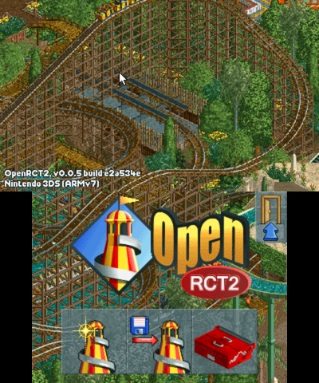
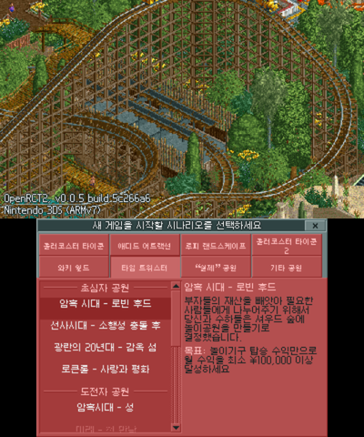

<h1 align="center">New 닌텐도 3DS용 OpenRCT2</h1>

<p align="center">
  <b>New 3DS에서 하는 롤러코스터 타이쿤 2.</b><br>
  <a href="https://github.com/OpenRCT2/OpenRCT2">OpenRCT2</a> v0.0.5의 비공식 포팅입니다. 공원은 위 화면에, 창은 터치 화면에
  나오고, 모든 조작이 터치로도 버튼으로도 됩니다.
</p>

<p align="center">
  <a href="README.md">English</a> · <b>한국어</b>
</p>

<p align="center">
  
  &nbsp;&nbsp;
  
</p>

<h3 align="center">
  <a href="https://github.com/gulf1324/OpenRCT2-n3ds/releases/latest/download/OpenRCT2-n3ds.zip">⬇&nbsp; OpenRCT2-n3ds.zip 받기</a>
</h3>

<p align="center">
  빌드가 끝난 게임이라 바로 설치하면 됩니다. <b>컴파일할 것이 없고</b>, Windows에서는 PC에 설치할 것도 없습니다.<br>
  <a href="https://github.com/gulf1324/OpenRCT2-n3ds/releases">모든 버전</a> · <a href="#설치">설치 방법</a> · <a href="#받은-파일에-든-것과-하는-일">PC에서 하는 일</a>
</p>

---

## 먼저 읽어 주세요

> [!WARNING]
> **첫 실행은 약 2분 동안 검은 화면만 나옵니다. 정상입니다: 전원을 끄거나 게임을 지우지 마세요.**
> 오브젝트 파일 2122개를 한 번 다 읽어 목록을 만드는 시간입니다. 그다음부터는 몇 초 만에 켜집니다.

> [!IMPORTANT]
> - **New 기종 전용입니다**: New 3DS, New 3DS XL, New 2DS XL. 구형 3DS·3DS XL·2DS에서는 안 됩니다(속도와 메모리가
>   모자랍니다). 본체에 커스텀 펌웨어가 있어야 합니다: 아직 없다면 [3ds.hacks.guide](https://3ds.hacks.guide)부터
>   보세요.
> - **본인의 RollerCoaster Tycoon 2가 필요합니다**(Steam 또는 GOG, PC에 설치된 것). 게임의 데이터 파일은 이 저장소에
>   없고, 설치 스크립트가 본인 PC에서 복사합니다.
> - **소리가 안 나나요?** 게임은 본체의 소리 펌웨어 `/3ds/dspfirm.cdc`가 있어야 소리를 내고, 없으면 아무 말 없이
>   무음으로 돕니다. [만드는 법](#no-sound).

## 설치

**필요한 것**

| | |
|---|---|
| 본체 | 커스텀 펌웨어(Luma3DS)가 설치된 **New** 3DS / New 3DS XL / New 2DS XL, 그리고 홈브루 앱 **FBI**와 **ftpd** |
| 게임 | PC에 설치된 **RollerCoaster Tycoon 2**(Steam 또는 GOG). RollerCoaster Tycoon 1은 선택입니다(그 시나리오) |
| PC | **Windows**: 설치할 것이 없습니다(설치 스크립트가 쓰는 Python이 받은 파일에 들어 있습니다). macOS·Linux: Python 3 |
| SD 카드 | 여유 공간 약 **1GB**(놀이기구 음악을 빼면 약 500MB) |

**네 단계**

1. **[OpenRCT2-n3ds.zip](https://github.com/gulf1324/OpenRCT2-n3ds/releases/latest/download/OpenRCT2-n3ds.zip)을 받아 전체를 풉니다**(ZIP을 오른쪽 클릭 → 압축 풀기). ZIP 안에서 바로
   `install.cmd`를 실행하면 안 됩니다. 릴리스 페이지에서 받을 때는 "Source code"가 아니라 이 파일을 받으세요.
2. **3DS에서 ftpd를 실행**하고 켜 둡니다. PC와 3DS가 같은 Wi-Fi에 있어야 합니다.
3. **PC에서, 푼 폴더의 `install.cmd`를 실행**하고(더블클릭) 질문에 답합니다.
   Windows가 인터넷에서 받은 파일이라고 경고하면 **추가 정보** → **실행**을 누르세요.
   macOS·Linux는 `python3 scripts/install.py`.
4. **3DS에서 ftpd를 닫고 FBI를 엽니다**: `SD` → `cias` → `openrct2.cia` → `Install CIA`.

이제 홈 메뉴에 OpenRCT2 아이콘이 있습니다. 다시 한번: **첫 실행은 약 2분 동안 검은 화면입니다.**

### 받은 파일에 든 것과 하는 일

인터넷에서 받은 스크립트를 실행하기 전에 의심해 보는 것은 당연합니다. 여기 든 것은 전부 확인할 수 있습니다.

| ZIP 안에서 | 무엇인가 |
|---|---|
| `install.cmd` | `scripts/install.py`를 실행하는 44줄짜리 글 파일. 메모장으로 열어 읽을 수 있습니다 |
| `scripts/` | 설치 스크립트: Python 파일 셋, 그냥 글입니다(약 750줄) |
| `python/` | **Python이 없는 PC를 위한 것**: [python.org](https://www.python.org/downloads/release/python-3148/)의 공식 Python 3.14.8 *Windows embeddable package (64-bit)*([이 파일](https://www.python.org/ftp/python/3.14.8/python-3.14.8-embed-amd64.zip))을 풀어서 그대로 넣었습니다 |
| `release/` | 게임: `openrct2.cia`와 `openrct2.3dsx`. 이 저장소의 소스로 빌드한 것입니다 |
| `sdcard/` | OpenRCT2 자체 데이터 파일(언어, 타이틀 시퀀스, 추가 그림) |

**설치 스크립트가 하는 일**은 이것뿐입니다.

1. RollerCoaster Tycoon 2 폴더를 **읽습니다**. 그 폴더는 절대 바꾸지 않습니다.
2. 푼 폴더 안에 파일 하나(`build/objdata.pak`: 오브젝트 파일을 하나로 이은 것)를 만듭니다.
3. 게임과 데이터를, 입력한 주소의 3DS로(FTP, ftpd로) 또는 지정한 SD 카드 드라이브로 **복사합니다**.

PC에 아무것도 설치하지 않고, 관리자 권한이 필요 없고, 푼 폴더 밖은 바꾸지 않고, 본인의 3DS 말고는 어디에도
접속하지 않습니다. PC에서 지우려면 그 폴더를 지우면 됩니다.

- **이미 Python 3이 있다면** `python` 폴더를 지워도 됩니다. 그러면 `install.cmd`가 PC의 Python을 씁니다.
- **들어 있는 Python을 확인하고 싶다면** python.org에서 같은 파일을 직접 받아 `python` 폴더와 비교하거나, 그 폴더를
  받은 것으로 바꾸세요. python.org가 공개한 SHA-256:
  `a93abe456ab01bd96d7a085b3cdb6566b3063f4241360d114142fbdb07f0a310`
- **ZIP을 확인하고 싶다면** [릴리스 페이지](https://github.com/gulf1324/OpenRCT2-n3ds/releases/latest)의 파일 옆에
  SHA-256이 있습니다.
- **그래도 못 믿겠다면** 전부 이 저장소에서 빌드할 수 있습니다: 아래 "개발자용".

<details>
<summary><b>설치 스크립트가 묻는 것</b></summary>

```
Language / 언어:  1 English  2 한국어 [1]: 2
이 PC에 있는 RollerCoaster Tycoon 2 폴더의 경로 [C:\...\steamapps\common\Rollercoaster Tycoon 2]:
RollerCoaster Tycoon 1 폴더의 경로 (시나리오용. 없으면 그냥 Enter):
놀이기구 음악도 복사할까요? 440MB라 Wi-Fi로는 약 15분이 더 걸립니다 [Y/n]:
어떻게 복사할까요?
  1  Wi-Fi로. 지금 3DS에서 ftpd를 실행하고 켜 둔 채로 두세요.
  2  SD 카드를 이 PC에 꽂았습니다 (훨씬 빠릅니다) [1]:
3DS의 ftpd 화면에 나오는 주소 (예: 192.168.0.12): 192.168.0.12
복사할 파일 2571개, 932MB (0개는 이미 있습니다).
Wi-Fi로 약 31분 걸립니다. 3DS를 열어 두고 충전기를 꽂아 두세요.
시작할까요? [Y/n]:
```

대괄호 안의 폴더는 Steam과 GOG가 보통 설치하는 자리에서 찾아 준 것입니다: 맞으면 Enter만 누르면 됩니다.

</details>

> [!TIP]
> - **Wi-Fi 복사는 약 30분 걸립니다**(놀이기구 음악을 빼면 약 16분). 3DS를 열어 두고 충전기를 꽂아 두세요. SD 카드를
>   PC에 꽂으면 1~2분입니다: 설치 스크립트에서 `2`를 고르세요.
> - **복사가 중간에 끊기면 설치 스크립트를 다시 실행하세요.** 이미 있는 것은 건너뛰고 이어서 합니다.
> - **언어**는 게임 안에서 고릅니다: 파일 메뉴(디스크 버튼) → 옵션 → 단위 탭. 첫 실행은 본체의 언어를 따릅니다(한국어
>   본체면 한국어).
> - **저장은 직접** 합니다(파일 메뉴). 자동 저장은 없습니다.

## 조작

| 버튼 | 하는 일 |
|---|---|
| **서클패드** | 위 화면 커서. 가장자리로 밀면 화면이 움직입니다 |
| **A** / **B** | 커서 자리에서 왼쪽 / 오른쪽 클릭 (B를 누른 채 움직이면 화면 끌기) |
| **십자키** | 터치 화면 창의 컨트롤 사이를 이동. 창이 없으면 화면 스크롤 |
| 십자키 포커스에서 **A** / **B** | 포커스된 컨트롤 누르기 / 뒤로 |
| **터치** | 탭 = 클릭, 끌기 = 목록 스크롤이나 큰 창 이동, 길게 누르기 = 누른 채 유지 |
| **L** / **R** | 축소 / 확대 |
| **X** | 화면 회전 |
| **Y** | 맨 앞 창 닫기 |
| **ZL** / **ZR** | 놓는 물건 회전 / Shift |
| **START** | 일시정지 |
| **SELECT** | 건설 취소 |
| **START + SELECT** | 종료 |

## 되는 것

인트로, 타이틀 화면, RCT2 시나리오, RollerCoaster Tycoon 1 시나리오(설치할 때 RCT1 폴더를 주면), 저장과 불러오기,
효과음, 놀이기구 음악.

| | |
|---|---|
| 속도 | 손님 약 1600명인 공원에서 기본 배율로 25~32fps, 끝까지 축소하고 가만히 있으면 약 10fps |
| 시작 | 홈 메뉴 아이콘에서 인트로까지 약 8초 (첫 실행 뒤부터) |
| 시나리오 불러오기 | 약 6초 |
| 언어 | **한국어**, 영어, 독일어, 프랑스어, 스페인어, 이탈리아어, 네덜란드어, 스웨덴어, 포르투갈어 등 게임의 기본 글꼴로 되는 언어 |
| 확인한 환경 | New 3DS XL, Steam판 RCT2와 RCT1 Deluxe. 다른 New 기종과 GOG판은 될 것으로 보지만 확인하지 못했습니다 |

일부러 뺀 것: 멀티플레이, 트루타입 글꼴(그래서 일본어·중국어·러시아어는 없습니다), 타이틀 시퀀스 편집기 등 PC 전용
옵션.

## 문제가 생기면

| 보이는 것 | 할 일 |
|---|---|
| **게임을 켰는데 검은 화면만 나옴** | 기다리세요. 첫 실행은 약 2분 걸립니다. 설치 스크립트가 오브젝트 파일을 바꾼 뒤의 첫 실행도 그렇습니다 |
| <a name="no-sound"></a>**소리가 안 남** | `/3ds/dspfirm.cdc`가 없습니다(설치 스크립트가 알려 줍니다). 3DS에서 **L + 십자키 아래 + Select**(Luma3DS의 Rosalina 메뉴) → Miscellaneous options → Dump DSP firmware. 한 번만 하면 됩니다 |
| **설치 스크립트가 연결하지 못함** | 3DS에서 ftpd가 켜져 있어야 하고, 두 기기가 같은 Wi-Fi에 있어야 합니다. 주소는 ftpd가 위 화면에 보여 주는 그대로 입력하세요 |
| **모든 공원이 "Unable to load file"**, 또는 **공원 하나 불러오는 데 1분 넘게 걸림** | SD 카드의 게임 데이터가 설치 스크립트가 올린 것이 아닙니다. 설치 스크립트를 다시 실행하세요. 전에 `ObjData`를 손으로 복사했다면 먼저 SD 카드의 `/3ds/openrct2/rct2/ObjData`를 지우세요 |
| **이름이 중간에 잘림** | 놀이기구·공원 이름은 세이브 형식의 한도로 한글 10자 남짓까지입니다 |
| **빨간 화면(크래시)** | Luma3DS의 화면입니다. 거기서 **A**를 눌러야 `/luma/dumps/arm11/`에 덤프가 저장됩니다 |

버그를 알릴 때는 게임의 로그 `/3ds/openrct2/user/log.txt`(지난 실행은 `log_prev.txt`)와 타이틀 화면 왼쪽 아래의 빌드
이름을 같이 주세요.

---

<details>
<summary><b>설치 스크립트가 SD 카드에 넣는 것</b></summary>

<br>

모든 것은 `/3ds/openrct2`로, 게임은 `/cias/openrct2.cia`로 갑니다. 이미 같은 크기로 있는 파일은 건너뜁니다.

| SD 카드에서 | |
|---|---|
| `/3ds/openrct2/data/` | OpenRCT2 자체 데이터 (받은 파일의 `sdcard/`) |
| `/3ds/openrct2/rct2/` | 본인의 RCT2 데이터. `ObjData`는 48개씩 하위 폴더로 나눕니다: 3DS는 파일을 열 때마다 폴더를 처음부터 훑는데, 한 폴더에 2122개가 있으면 파일 하나에 0.25초가 걸립니다 |
| `/3ds/openrct2/user/objdata.pak` | 오브젝트 파일 전부를 바이트 그대로 하나로 묶은 파일(191MB). PC에서 만듭니다: 공원을 몇 초 만에 불러옵니다 |
| `/3ds/openrct2/rct1/Scenarios/` | RCT1 폴더를 줬다면 그 시나리오 (타이틀 음악은 `rct2/Data/css50.dat`로) |
| `/3ds/openrct2/user/` | 게임이 설정, 세이브, 캐시를 두는 곳 |
| `/cias/openrct2.cia` | 게임. 받은 파일의 `release/`에 있는 것 |

- **질문 없이**: Wi-Fi로는 `install.cmd --rct2 <폴더> [--rct1 <폴더>] [--no-music] --ip <주소>`, PC에 꽂은 SD 카드로는
  `--sd <드라이브>`. `--dry-run`은 무엇을 복사할지만 알려 줍니다. (`install.cmd`는 이것들을 `scripts/install.py`에
  그대로 넘깁니다.)
- **CIA 없이**: `release/openrct2.3dsx`를 SD 카드의 `/3ds/`에 넣고 Homebrew Launcher에서 실행합니다. 같은 데이터를
  읽습니다.
- **커스텀 오브젝트**: 나중에 `ObjData`의 파일을 바꾸면 설치 스크립트를 다시 실행하세요. 게임의 오브젝트 목록도 지워
  줍니다(게임은 그 목록을 믿고 폴더를 다시 보지 않습니다).

</details>

<details>
<summary><b>개발자용: 소스와 빌드 방법</b></summary>

<br>

| | |
|---|---|
| `external/OpenRCT2/` | 게임: OpenRCT2 v0.0.5에 포팅을 얹은 소스. 이 저장소의 첫 커밋이 손대지 않은 v0.0.5이므로 `git diff <첫 커밋> HEAD -- external/OpenRCT2`가 포팅이 바꾼 전부입니다 |
| `scripts/` | 설치 스크립트, 툴체인 설치, 빌드, 기기로 파일 보내기 |
| `sdcard/` | OpenRCT2 자체 데이터(`g2.dat`, 언어, 타이틀 시퀀스). v0.0.5 릴리스의 것 그대로입니다 |
| `release/` | 빌드한 게임: `openrct2.cia`, `openrct2.3dsx` |
| `docs/` | 이 페이지의 그림, 그리고 받는 파일에 들어가는 `README.txt` |
| `cia/`, `cmake/` | 홈 메뉴 아이콘과 배너, 프로그램 설정, CMake 툴체인 파일 |

포팅 코드는 `src/platform/n3ds.c`(경로, 메모리, 성능 로그), `src/platform/n3ds_input.cpp`(입력, 버튼 이동, 두
화면 출력), `src/platform/n3ds_font.c`(한글 글꼴), `src/drawing/n3ds_drawing.c`(크기를 바꿔 그리기)와 그 밖의
`#ifdef __3DS__` 블록에 있습니다. `n3ds port:`로 시작하는 주석이 원본을 왜 바꿨는지 적은 것입니다. v0.0.5 위에 이후
OpenRCT2 버전의 버그 수정 약 40개를 얹었습니다. v0.0.5인 이유: 원본 `rct2.exe` 없이 단독으로 도는 첫 OpenRCT2
버전이고, 콘솔에 올릴 만큼 작습니다(C와 약간의 C++, 소프트웨어 렌더링, 스크립팅 없음).

빌드는 Windows + Git Bash에서 합니다. 모든 도구는 이 폴더 안(`tools/`)에만 설치되고 그 밖은 건드리지 않습니다.

```
bash scripts/setup_toolchain.sh     # devkitARM, libctru (devkitPro 패키지를 tools/에 풉니다)
bash scripts/setup_hosttools.sh     # CMake 3.31, ninja
bash scripts/setup_ciatools.sh      # makerom, bannertool
bash scripts/fetch_sources.sh       # SDL2, libzip, speexdsp를 external/에
source ./env.sh
bash scripts/build_deps.sh          # 그 셋을 3DS용으로 빌드
cmake -S external/OpenRCT2 -B build/openrct2 -G Ninja -DCMAKE_TOOLCHAIN_FILE=$PWD/cmake/3ds-win.cmake -DCMAKE_BUILD_TYPE=RelWithDebInfo
cmake --build build/openrct2        # build/openrct2/openrct2.3dsx
python scripts/make_cia.py          # build/openrct2/openrct2.cia
python scripts/make_release.py v0.1.0   # build/release/OpenRCT2-n3ds.zip: 릴리스에서 받는 파일
```

릴리스에서 받는 파일은 이 저장소의 일부(설치 스크립트, `release/`, `sdcard/`)에 python.org의 Windows용 내장형
Python을 곁들인 것입니다. 저장소를 받아도 같은 방법으로 설치되고, 그때는 PC의 Python 3을 씁니다.

`make_cia.py`는 배너의 소리를 `gamedata/rct2/Data/css17.dat`에서 가져옵니다(RCT2 폴더를 `gamedata/rct2`로
복사하거나 연결). 없으면 배너는 무음입니다. 그 밖의 스크립트: `send.cmd`(3dslink로 .3dsx를 무선 전송),
`ftp.cmd`(ftpd와 파일 주고받기), `crash_report.cmd`(같은 빌드의 `.elf`로 Luma3DS 크래시 덤프 읽기). 3DS의 주소는
설치 스크립트가 써 두는 `local.env`에서 읽습니다.

</details>

## 라이선스

OpenRCT2와 같은 GPLv3입니다: [LICENSE](LICENSE). OpenRCT2는
[OpenRCT2 개발자들](external/OpenRCT2/contributors.md)의 작업입니다. 이 포팅은 그들이나 Atari, Chris Sawyer,
닌텐도와 관계가 없는 비공식 프로젝트입니다. RollerCoaster Tycoon은 Atari의 상표입니다.

devkitPro, libctru, SDL2로 만들었습니다. 한글은 이민서 님의 [갈무리](https://github.com/quiple/galmuri) 글꼴로
그립니다(SIL Open Font License: `external/OpenRCT2/src/platform/n3ds/galmuri-OFL.txt`).
